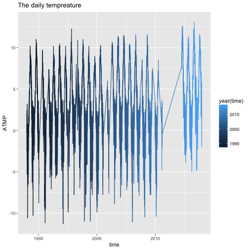
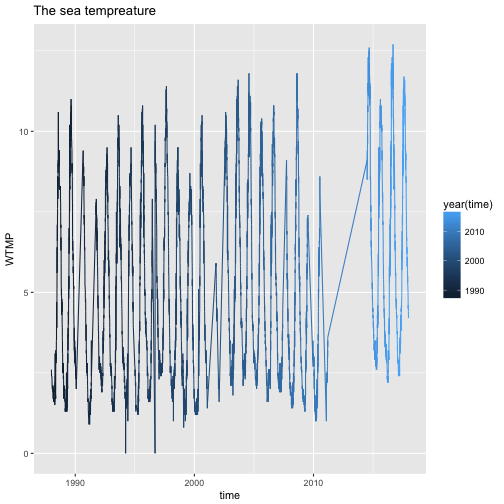

Tempreature study of station 46035
========================================================
author:Ruijie Ma,Han Xiao,Tianlang Yang
date: 3/18/2018
autosize: true

Preview
========================================================

- graph analysis
- statistical analysis
- answer of question from assignment5

Graph of daily tempreature
========================================================


Graph of sea tempreatrue
========================================================


Analysis
========================================================

##As we can see from the graphs, there is a obvious increase of both daily and see tempreture between 2011 to 2015

T-test
========================================================
## t-test of daily tempreature samples

```

	Welch Two Sample t-test

data:  sample1 and sample2
t = -4.6603, df = 190.78, p-value = 5.916e-06
alternative hypothesis: true difference in means is not equal to 0
95 percent confidence interval:
 -4.010728 -1.625272
sample estimates:
mean of x mean of y 
    2.509     5.327 
```
T-test
========================================================
## t-test of daily tempreature samples

```

	Welch Two Sample t-test

data:  sample3 and sample4
t = -3.811, df = 197.69, p-value = 0.0001848
alternative hypothesis: true difference in means is not equal to 0
95 percent confidence interval:
 -2.3323424 -0.7416576
sample estimates:
mean of x mean of y 
    4.626     6.163 
```
Analysis
========================================================
## In this case, we randomly select 100 samples from 1988 and 2017 to do the t-test for identifying the change of daily and sea tempreture over around 30 years.The test1 is about daily tempreture,as we can see,the p-value of both test is smaller than 1% which means that the significance the difference is statistically significant.Therefore, the mean tempreature changes over 30 years

Answer to the question
========================================================
## The sampling does light effect to the evaluation of tempreature change since the tempreature is different each days or hours. Analyze them by random selecting creates some difference but the general trend will not be changed.
